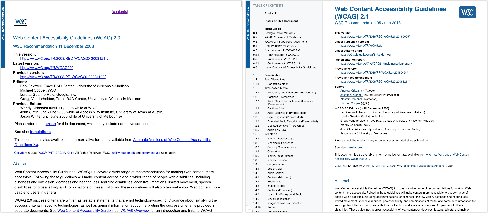
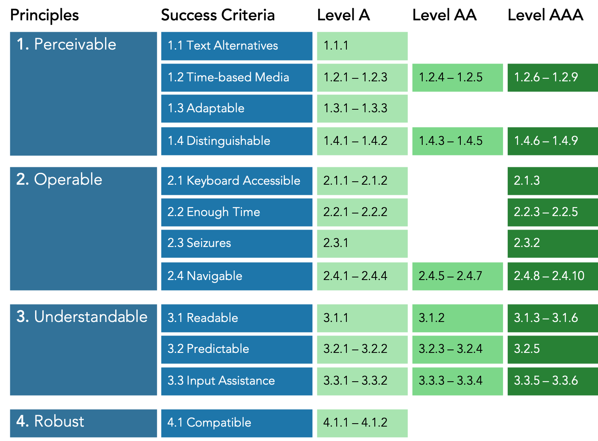
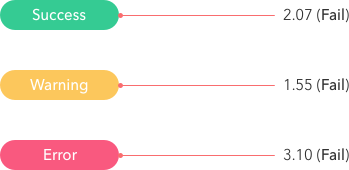
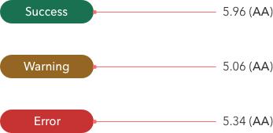
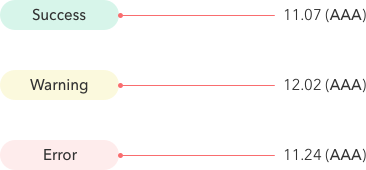
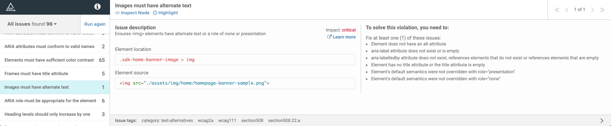
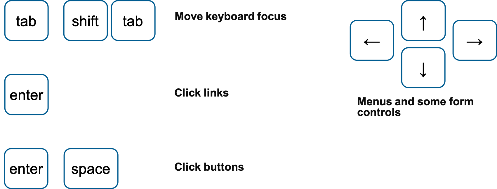

# Introduction to Web Accessibility

<p class="author">
    Tao Zhang
</p>

<p id="slidesInfo">Nov 1, 2019 · AWS Activate</p>

---

<h2 class="centertitle">What is accessibility?</h2>

Make content usable for everyone regardless of abilities

---

Web accessibility means people with disabilities can:

- **Use** the web
- **Perceive**,**understand**,**navigate**,and **interact** with the web
- **Contribute** to the web

---

## Disability statistics

- 15% of world population lives with some form of disability
- In the US, 1 in 5 adults has a disability
- 8% of male have some degree of color blindness

---

<h3 class="centertitle">Wide range of disabilities</h2>

<p class="centerp">
    
</p>
<p id="mssource"><a href="https://www.microsoft.com/en-us/design/inclusive">Inclusive Design at Microsoft</a></p>

---

## Why is accessibility important?

- The ADA and Section 508
- People with different abilities should have equal access to the web
- Good accessibility is good user experience

---

## WCAG

<p class="centerp">Web Content Accessibility Guidelines</p>

---

<p class="centerp">
    
</p>

---

## Overview of WCAG 2.0

<p class="centerp">
    
</p>

---

## Level of conformance

- Level A: The minimum level
- Level AA: Generally recommended
- Level AAA: Not required as general policy

---

## What we will cover today

- Focus and tab order
- Color and color contrast
- Text alternatives
- Semantic HTML
- A DIY accessibility test process

---

## Focus and tab order

<ul>
    <li class="fragment"><a href="https://www.w3.org/TR/UNDERSTANDING-WCAG20/navigation-mechanisms-focus-visible.html">WCAG 2.4.7</a>: Interactive elements should have clear focus.</li>
    <li class="fragment"><a href="https://www.w3.org/TR/UNDERSTANDING-WCAG20/content-structure-separation-sequence.html">WCAG 1.3.2</a>: Navigation (tab) order should be logical and intuitive.</li>
    <li class="fragment"><a href="https://www.w3.org/TR/UNDERSTANDING-WCAG20/keyboard-operation-keyboard-operable.html">WCAG 2.1.1</a>: Keyboard users should be able to use functionalities using keyboard only.</li>
    <li class="fragment"><a href="http://www.w3.org/TR/UNDERSTANDING-WCAG20/keyboard-operation-trapping.html">WCAG 2.1.2</a>: Content does not "trap" keyboard focus within subsections.</li>
</ul>

---

<p class="centerp">
    <a href="https://developer.mozilla.org/en-US/">Demo: Focus and tab order on MDN web docs</a>
</p>

---

<p class="centerp">
    <a href="images/modal_example.gif">Demo: Focus trap in dialog</a>
</p>

---

<p class="centerp">
    <a href="https://arcgis103.esri.ca/WCAG-Configurable-Template-Test/?appid=e951691e3893444ea64e7c29d086e30c">Example: Accessible App of Electric Charging Stations</a>
</p>

---

## Test focus and tab order

- Tab through page to verify all interactive elements have focus
- Focus order matches intended reading order
- Interact with all links and controls using only keyboard
- No keyboard trap except for modals
- Off-screen/invisible content does not receive focus

---

## Color and color contrast

<ul>
    <li class="fragment"><a href="http://www.w3.org/TR/UNDERSTANDING-WCAG20/visual-audio-contrast-without-color.html">WCAG 1.4.1</a>: Color is not the only visual means of conveying information.</li>
    <li class="fragment"><a href="http://www.w3.org/TR/UNDERSTANDING-WCAG20/visual-audio-contrast-contrast.html">WCAG 1.4.3</a>: Text needs to have contrast ratio of at least 4.5:1.</li>
</ul>

---

<p class="centerp">
    <a href="https://jimmieego.github.io/Web-Accessibility-Best-Practices/demos/color-contrast/index.html">Demo: Color and color contrast</a>
</p>

---

<h2 class="centertitle">White text on colored background</h2>

<p class="centerp">
    
</p>
<hr>
<p class="centerp">
    
</p>

---

<h2 class="centertitle">Flipping the contrast</h2>

<p class="centerp">
    
</p>

---

## Test color and color contrast

- Look for content differentiated by color only
- Use a [contrast ratio calculator](https://contrast-ratio.com/)
- Review color contrast issues reported by automated test tool ([aXe](https://chrome.google.com/webstore/detail/axe/lhdoppojpmngadmnindnejefpokejbdd))

---

<h2 class="twocoltitle">Text alternatives</h2>

<p>
    <a href="https://www.w3.org/TR/UNDERSTANDING-WCAG20/text-equiv-all.html">WCAG 1.1.1</a>: Non-text content has text alternative.
</p>
<p>
    If image is decorative, use `alt=""`.
</p>

---

<p class="centerp">
    <ul>
    <li><a href="https://developers.arcgis.com/javascript/latest/sample-code/widgets-basemapgallery/live/index.html">Demo: Text alternative - empty alt</a></li>
     <li><a href="https://story.maps.arcgis.com/apps/MapJournal/index.html?appid=2b1c793f464b4cd2944a0b9700c0dc48">Demo: Text alternative - descriptive</a></li>
     </ul>
</p>

---

## Write effective alternate text

- Think about how users will be doing with the information
- Be accurate in presenting the content in images
- Be succinct
- No need to use the phrase "image of ..." to describe images

---

## Semantic HTML

Choose the right HTML element to reflect content structure and meaning.

---

### Structure

- Common understanding of what each element represents and does.
- Browsers and other user agents provide default functionality and styling.

---

### Structure example

```
<h2>User settings</h2>

<!-- Don't do this -->
<span class="heading-2">Popup settings</span> 
```

- The browser does not recognize the second structure as a level 2 heading.
- The `<span>` element is semantically neutral.

---

### Meaning

Most HTML elements have an implicit role that defines the element’s purpose:

- `<a>`: “link”
- ``: "graphic" or "image"
- `<header>`: "banner"

---

### Meaning example

```
<button>Save changes</button>

<!-- Don't do this -->
<div class="btn btn--primary">Save changes</div>
```

- The browser does not know that the `<div>` element is intended as a button
- The `<div>` element does not have an implicit role or accessible name.

---

### Why semantic HTML

- Consistent understanding of content structure and native behavior. <!-- .element: class="fragment" -->
- Clear communication of content’s meaning and purpose. <!-- .element: class="fragment" -->
- We get structure and meaning for free with semantic elements. <!-- .element: class="fragment" -->
- Significant more work to polyfill semantic neutral elements. <!-- .element: class="fragment" -->

---

### Use `button`

- Buttons are automatically focusable. <!-- .element: class="fragment" -->
- Screen readers will announce button in focus and offer ways to click button. <!-- .element: class="fragment" -->
- Space and Enter keys are automatically supported when binding a click event listener to a button. <!-- .element: class="fragment" -->

---

## DIY accessibility test

<ol>
    <li>Automated test</li>
    <li>Keyboard test</li>
    <li>Screen reader test</li>
    <li>Color test</li>
</ol>

---

<h2>Automated test with <a href="https://www.deque.com/products/axe/">aXe</a></h2>

<p class="centerp">
    
</p>

<ul>
    <li>Tests rendered page in browser</li>
    <li>Less false positives</li>
    <li>Accessible</li>
</ul>

---

<p class="centerp">
    <a href="https://aws.amazon.com/">Demo: Automated test using aXe</a>
</p>

---

<h2 class="centertitle">Keyboard test</h2>

<p class="centerp">
    
</p>

---

<h2 class="centertitle">Screen reader</h2>

| OS      | Screen reader | Browser |
|---------|---------------|---------|
| MacOS   | [VoiceOver](https://www.apple.com/accessibility/mac/vision/)     | Safari  |
| Windows | [NVDA](https://www.nvaccess.org/)          | Firefox |
| Windows | [JAWS](http://www.freedomscientific.com/Products/Blindness/JAWS)          | IE/Edge |

---

## Screen reader basics

- [A11ycasts: VoiceOver](https://youtu.be/5R-6WvAihms)
- [A11ycasts: NVDA](https://youtu.be/Jao3s_CwdRU)

---

## Color test

- Automated color contrast test results may need manual verification
- Look for information differentiated only by color

---

## Additional resources

- [MDN: Accessibility](https://developer.mozilla.org/en-US/docs/Web/Accessibility)
- [Google Developers Web Fundamentals: Accessibility](https://developers.google.com/web/fundamentals/accessibility/)
- [The A11Y Project](https://a11yproject.com/)

---

## Questions?