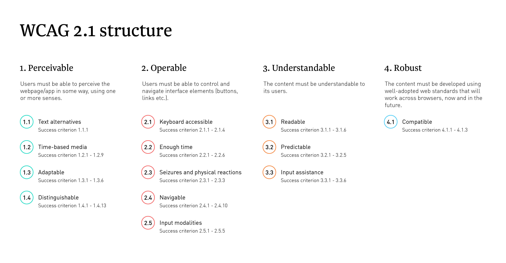

# Introduction to Web Accessibility

<p class="author">
    Tao Zhang
</p>

<p id="slidesInfo">July 30, 2021 · AWS DevTools</p>

---

<h2 class="centertitle">What is accessibility?</h2>

<p class="centerp">Make content usable for everyone regardless of abilities</p>

---

Web accessibility means people with a wide range of abilities can:

- **Use** the web
- **Perceive**, **understand**, **navigate**, and **interact** with the web
- **Contribute** to the web

---

## Disability statistics

- 15% of world population lives with some form of disability
- In the US, 1 in 5 adults has a disability
- 8% of male have some degree of color blindness

---

<h3 class="centertitle">Wide range of disabilities</h2>

<p class="centerp">
    
</p>
<p id="mssource"><a href="https://www.microsoft.com/en-us/design/inclusive">Inclusive Design at Microsoft</a></p>

Note:
There are many different types of disabilities affecting people's abilities to touch, see, hear, or speak.

"Disabilities" could be permanent, temporary, or situational. For example, a parent may be holding a child while trying to use the phone; or a person may be in a noisy environment while trying to watch a video. People's normal abilities may be constrained by the situation, but they still need the same access to information.

---

## Why is accessibility important?

- The ADA and Section 508
- People with different abilities should have equal access to the web
- Good accessibility is good user experience

Note:
In the US, the Department of Justice (DOJ) published the Americans with Disabilities Act (ADA) Standards for Accessible Design in September 2010. These standards state that all electronic and information technology must be accessible to people with disabilities.

Section 508 regulations are an amendment to the Rehabilitation Act of 1973 and apply to all information technology, including computer hardware, software and documentation. Section 508 requires federal agencies to make their information and communication technology accessible for everyone.

In addition to the law requirements, the web is originally designed for everyone. Everyone has abilities and limits to those abilities. Those limits should not be treated as obstacles to accessing the web.

Implementing accessibility can deepen our understanding of design. Considering things like tab order can take us beyond a vision of design as the look and feel and into the realm of user experience and usability. Accessibility is just another aspect of considering how to best build our products to meet diverse user needs. The more we consider accessibility, the more profoundly we will understand user experience and anticipate user behavior—making us better designers and developers.

---

## WCAG

<p class="centerp">Web Content Accessibility Guidelines</p>

Note:
The Web Content Accessibility Guidelines (WCAG) is developed by the W3C. It is the international standard for making web content accessible. WCAG has been adopted by laws and standards in a lot of countries and regions. In the US, the Section 508 regulations incorporates WCAG 2.0.

---

<p class="centerp">
    
</p>

Note:
WCAG 2.0 was published in December 2008 and WCAG 2.1 was published in June 2018. WCAG 2.1 extends WCAG 2.0 by adding a number of new success criteria and guidelines.

---

<p class="centerp">
    
</p>

Note:
WCAG are organized by four basic principles:

1. Content must be perceivable.
2. Interface elements in the content must be operable.
3. Content and controls must be understandable.
4. Content must be robust enough to work with current and future technologies.

Each principle contains testable success criteria, which are set at three levels: A, AA, and AAA. In most cases, we are aiming for the AA conformance level, as the A level is really the most basic requirements, and achieving AAA could be costly.

---

## Level of conformance

- Level A: The minimum level
- Level AA: Generally recommended
- Level AAA: Not required as general policy

---

## What we will cover today

- Focus and tab order
- Color and color contrast
- Text alternatives
- Semantic HTML
- A DIY accessibility test process

Note:
I have selected a few topics that are probably the most fundamental accessibility requirements for any web pages: keyboard focus, tab order, color and color contrast, text alternatives, and semantic HTML. These are great foundations to start learning about accessibility. They are easy to relate to and test, and they benefit virtually all users.

For each topic, I will discuss relevant WCAG success criteria and then I will show you a few examples of how to meet those success criteria.

Finally, I will talk about a do-it-yourself process for testing accessibility. Working to accommodate a diverse range of abilities means there are a correspondingly diverse range of issues to consider. I break down these issues into a logical, step by step process so that we all can follow.

---

## Focus and tab order

<ul>
    <li class="fragment"><a href="https://www.w3.org/TR/UNDERSTANDING-WCAG20/navigation-mechanisms-focus-visible.html">WCAG 2.4.7</a>: Interactive elements should have clear focus.</li>
    <li class="fragment"><a href="https://www.w3.org/TR/UNDERSTANDING-WCAG20/content-structure-separation-sequence.html">WCAG 1.3.2</a>: Navigation (tab) order should be logical and intuitive.</li>
    <li class="fragment"><a href="https://www.w3.org/TR/UNDERSTANDING-WCAG20/keyboard-operation-keyboard-operable.html">WCAG 2.1.1</a>: Keyboard users should be able to use functionalities using keyboard only.</li>
    <li class="fragment"><a href="http://www.w3.org/TR/UNDERSTANDING-WCAG20/keyboard-operation-trapping.html">WCAG 2.1.2</a>: Content does not "trap" keyboard focus within subsections.</li>
</ul>

Note:
WCAG 2.4.7 Clear focus

Focus is the visual indicator that shows which control on the screen currently receives input from the keyboard. If users use keyboard to navigate a page, they should be able to see which control they are on at any time.

The best way to ensure clear focus is to have a visible border or outline around the element in use, whether it’s a form field, link, menu, content area or any other interactive element. This makes it easier for your users to understand where they are on a page.

Browsers have default styles for focus. We could customize the focus style if needed, but don't just disable the browser's default focus style.

WCAG 1.3.2 Tab order

Tab order is the order in which focus proceeds forward and backward through interactive elements via the Tab key. As a keyboard user navigates through the page, the order in which interactive items receive keyboard focus is important.

The default keyboard navigation order must be logical and intuitive. For example, in English we read from left to right and from top to bottom. So the tab order should follow the visual flow of the page: left to right and top to bottom. And we should let the web page's source code determine the tab order.

I should point out that letting the keyboard focus jumping around on the page is not only an accessibility issue, but also a usability issue. It just makes using the keyboard to work with the page a lot harder than necessary.

WCAG 2.1.1 Keyboard access

Many people use keyboard to use a web page. Some of them may have motor impairment, and some may be power users that are faster with keyboard. Like mouse users, keyboard users should be able to use forms, menus, or any other functionalities on a web page.

WCAG 2.1.2 Keyboard trap

A keyboard trap occurs when a user can get into a subsection on a web page by using the keyboard, but the user cannot get out of that subsection through the keyboard.

A common exception of this rule is when we show a modal dialog to the user, the dialog needs to trap keyboard focus until the user chooses to close the dialog. This is because the dialog introduces a new workflow to the user and needs the user's input to complete the new workflow.

---

<p class="centerp">
    <a href="https://developer.mozilla.org/en-US/">Demo: Focus and tab order</a>
    <!-- <a href="https://us-west-2.console.aws.amazon.com/activate/home?#/apply">Demo: Focus and tab order</a> -->
</p>

---

<p class="centerp">
    <a href="https://github.com/">Demo: Keyboard access</a>
</p>

---

<p class="centerp">
    <a href="images/modal_example.gif">Demo: Focus trap in dialog</a>
    <!-- <a href="https://us-west-2.console.aws.amazon.com/activate/home?#/apply">Demo: Focus trap in dialog</a> -->
</p>

---

<!-- <p class="centerp">
    <a href="https://arcgis103.esri.ca/WCAG-Configurable-Template-Test/?appid=e951691e3893444ea64e7c29d086e30c">Example: Accessible App of Electric Charging Stations</a>
</p>

--- -->

## Test focus and tab order

- Tab through page to verify all interactive elements have focus
- Focus order matches intended reading order
- Interact with all links and controls using only keyboard
- No keyboard trap except for modals
- Off-screen/invisible content does not receive focus

---

## Color and color contrast

<ul>
    <li class="fragment"><a href="http://www.w3.org/TR/UNDERSTANDING-WCAG20/visual-audio-contrast-without-color.html">WCAG 1.4.1</a>: Color is not the only visual means of conveying information.</li>
    <li class="fragment"><a href="http://www.w3.org/TR/UNDERSTANDING-WCAG20/visual-audio-contrast-contrast.html">WCAG 1.4.3</a>: Text needs to have contrast ratio of at least 4.5:1.</li>
</ul>

Note:
WCAG 1.4.1 Color only info

Users with visual impairment need help when we use color on the web. As many as 1 in 12 men have some degree of color blindness. That means about 8% of male users may struggle if we don't use color correctly. For example, if we use red text only to show an error message, users who cannot see red will not notice that message is an error. So that error message needs at least one more means to convey the meaning, like an error icon.

As another example, when we use color only to show different datasets in a chart, color blind users may not understand the different datasets. We should add clear labelling and patterns to those datasets, in addition to colors.

This guideline is not about removing color from our web pages or making web pages black and white, far from it. It just means that color should not be the only way of conveying information. Adding additional ways of conveying the same information in a lot of cases not only improves the accessibility, but also the overall user experience.

WCAG 1.4.3 Contrast ratio

All of us will benefit from a good contrast between text and its background color. For users with visual impairments, good contrast is essential.

---

<p class="centerp">
    <a href="https://jimmieego.github.io/Web-Accessibility-Best-Practices/demos/color-contrast/index.html">Demo: Color and color contrast</a>
</p>

---

<h2 class="centertitle">White text on colored background</h2>

<p class="centerp">
    
</p>
<hr>
<p class="centerp">
    
</p>

Note:
White text on colored background

When using white text on a colored background, it is sometimes hard to achieve a good contrast. You may be surprised how dark the color needs to be to meet the 4.5 contrast ratio. This can create hierarchy issues when those elements are not supposed to be the focus of the page - dark colored backgrounds will really grab the user's attention.

---

<h2 class="centertitle">Flipping the contrast</h2>

<p class="centerp">
    
</p>

Note:
Flipping the contrast

You can solve the problem by flipping the contrast. Instead of using light text on a dark colored background, use dark colored text on a light colored background. The color is still there to help support the text, but it's way less prominent and does not interfere as much with other parts of the page.

---

## Test color and color contrast

- Look for content differentiated by color only
- Use a [contrast ratio calculator](https://contrast-ratio.com/)
- Review color contrast issues reported by automated test tool ([aXe](https://chrome.google.com/webstore/detail/axe/lhdoppojpmngadmnindnejefpokejbdd))

---

<h2 class="twocoltitle">Text alternatives</h2>

<p>
    <a href="https://www.w3.org/TR/UNDERSTANDING-WCAG20/text-equiv-all.html">WCAG 1.1.1</a>: Non-text content has text alternative.
</p>
<p>
    If image is decorative, use `alt=""`.
</p>

Note:

WCAG 1.1.1 Text alternatives

Alternative (or 'alt') text is a text replacement for non-text content like images. Non-sighted users rely on the alternative text to understand information in images. When they use screen reader and encounter an image, the screen reader will announce the alt text of the image. If the image does not have alt text, the screen reader will usually announce the file name of the image, which is not useful.

A common exception for this guideline is that if an image is decorative and it does not convey meaning, we should set the alternative text to an empty string.

---

<p class="centerp">
    <ul>
    <li><a href="https://developers.arcgis.com/javascript/latest/sample-code/widgets-basemapgallery/live/index.html">Demo: Text alternative - empty alt</a></li>
     <li><a href="https://story.maps.arcgis.com/apps/MapJournal/index.html?appid=2b1c793f464b4cd2944a0b9700c0dc48">Demo: Text alternative - descriptive</a></li>
     </ul>
</p>

---

## Write effective alternate text

- Think about how users will be doing with the information
- Be accurate in presenting the content in images
- Be succinct
- No need to use the phrase "image of ..." to describe images

---

## Semantic HTML

Choose the right HTML element to reflect content structure and meaning.

---

### Structure

- Common understanding of what each element represents and does.
- Browsers and other user agents provide default functionality and styling.

---

### Structure example

```
<h2>User settings</h2>

<!-- Don't do this -->
<div class="heading-2">Account settings</div>
```

- The browser does not recognize the second structure as a level 2 heading.
- The `<div>` element is semantically neutral.

---

### Meaning

Most HTML elements have an implicit role that defines the element’s purpose:

- `<a>`: “link”
- ``: "graphic" or "image"
- `<header>`: "banner"

---

### Meaning example

```
<button>Save changes</button>

<!-- Don't do this -->
<div class="btn btn--primary">Save changes</div>
```

- The browser does not know that the `<div>` element is intended as a button
- The `<div>` element does not have an implicit role or accessible name.

---

### Why semantic HTML

- We get structure and meaning for free with semantic elements. <!-- .element: class="fragment" -->
- Consistent and clear communication of content’s meaning and purpose. <!-- .element: class="fragment" -->
- Significant more work to polyfill semantic neutral elements. <!-- .element: class="fragment" -->

---

### Use `button`

- Buttons are automatically focusable. <!-- .element: class="fragment" -->
- Screen readers will announce button in focus and offer ways to click button. <!-- .element: class="fragment" -->
- Space and Enter keys are automatically supported when binding a click event listener to a button. <!-- .element: class="fragment" -->

---

## DIY accessibility test

<ol>
    <li>Automated test</li>
    <li>Keyboard test</li>
    <li>Screen reader test</li>
    <li>Color test</li>
</ol>

---

<h2>Automated test with <a href="https://www.deque.com/products/axe/">aXe</a></h2>

<p class="centerp">
    
</p>

<ul>
    <li>Tests rendered page in browser</li>
    <li>Less false positives</li>
    <li>Accessible</li>
</ul>

Note:
aXe is an extension that you can install in Chrome and Firefox. It tests the rendered page in Chrome and Firefox. It reports any violations against a set of accessibility rules and best practices. A big advantage of aXe, compared to other automated testing tools, is that it is relatively conservative, meaning it tends to report less false positives. And aXe itself is accessible. Keyboard users and non-sighted users should be able to use aXe for automated tests.

I should point out that automated tests cannot replace manual tests using keyboard and screen reader. Automated test tools like aXe can help us quickly find certain types of issues, but not all. For example, an automated test tool can tell us an image is missing alt text, but it cannot judge whether an alt text is meaningful for the image.

---

<p class="centerp">
    <a href="https://polaris.a2z.com/">Demo: Automated test using aXe</a>
    <!-- <a href="https://us-west-2.console.aws.amazon.com/activate/home?#/apply">Demo: Automated test using aXe</a> -->
</p>

---

<h2 class="centertitle">Keyboard test</h2>

<p class="centerp">
    
</p>

Note:
The second step is keyboard test. This means using the Tab key or Shift and Tab keys to move focus on the page, using Enter key to click links, and using Enter or Space key to click buttons. Some interactive elements, like menus, tabs, or select, may require the arrow keys.

The goal of the keyboard test is to see if the web page provides the same functionalities to keyboard users as mouse users. It may help to unplug or disable the mouse, and try to use the keyboard to perform the tasks that mouse users would do. If an interactive element does not have keyboard focus or it cannot be tabbed to, there is a keyboard accessibility issue. If the focus jumps around on the page, there could be a keyboard accessibility issue as well.

---

<h2 class="centertitle">Screen reader</h2>

| OS      | Screen reader                                                    | Browser |
| ------- | ---------------------------------------------------------------- | ------- |
| MacOS   | [VoiceOver](https://www.apple.com/accessibility/mac/vision/)     | Safari  |
| Windows | [NVDA](https://www.nvaccess.org/)                                | Firefox |
| Windows | [JAWS](http://www.freedomscientific.com/Products/Blindness/JAWS) | IE/Edge |

Note:
The third step is testing using screen readers.

A "screen reader" is the generic term for a program that helps blind people use a computer. Simply put, a screen reader will "read" (speak) the content of a page to the blind user.

A blind person using a screen reader experiences a website linearly, a little bit at a time. If an element does not have enough information for the screen reader to read what it is, the blind user may have difficulty understanding what the element is meant for.

Due to time limitation, I will not discuss details of using screen readers. But here is recommended pairing between screen readers and browsers. VoiceOver is the built-in screen reader in MacOS, so it works well with Safari. NVDA is a free screen reader in Windows and it is recommended for Firefox. Jaws is another screen reader in Windows and traditionally it works well with Microsoft browsers like IE and Edge. Jaws requires a paid license.

---

## Screen reader basics

- [A11ycasts: VoiceOver](https://youtu.be/5R-6WvAihms)
- [A11ycasts: NVDA](https://youtu.be/Jao3s_CwdRU)

Note:
Note that screen readers have the browse and tab modes. For more details, I recommend these two video tutorials for VoiceOver and NVDA. They cover the basic commands to read and interact with web content for testing purposes. Both of the videos are parts of the a11ycasts series on Youtube. I will share this presentation so you will have the URLs.

---

## Color test

- Automated color contrast test results may need manual verification
- Look for information differentiated only by color

Note:
The last step is manual color test. This step is necessary because automated test tools cannot cover all color issues. For example, a background may use color gradient, not a single color. And for information like error messages, we have to manually look at it to see if they use color only to communicate the meaning.

---

## Additional resources

- [Wiki: Amazon Accessibility](https://w.amazon.com/bin/view/Accessibility/)
- [MDN: Accessibility](https://developer.mozilla.org/en-US/docs/Web/Accessibility)
- [The A11Y Project](https://a11yproject.com/)

---

## Questions?

<p class="centerp contactinfo"><a href="mailto:taozhat@amazon.com">taozhat@amazon.com</a></p>

Note:
That concludes our presentation. I will be happy to answer any questions you may have.
